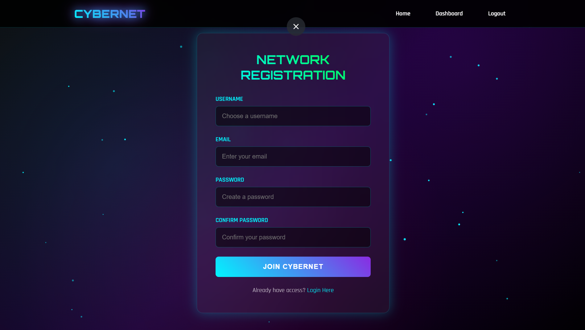
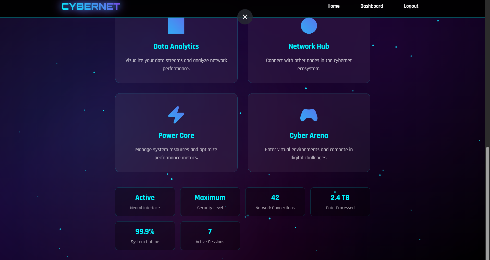

# CyberNet Login System

A modern, secure, and responsive login system built with Flask, SQLAlchemy, and Flask-Mail. This project features user registration, login, password reset via email, and a dashboard, all styled with a custom responsive UI.

---

## Features

- **User Registration**: Create a new account with username, email, and password validation.
- **User Login**: Login with username or email and password.
- **Password Reset**: Secure password reset via email with expiring token.
- **Dashboard**: Personalized dashboard for logged-in users.
- **Session Management**: Secure session handling and logout.
- **Admin User**: Auto-creates an admin user on first run.
- **Responsive UI**: Modern, mobile-friendly design with sticky navbar.
- **Security**: Passwords hashed, strong password validation, session protection.

---

## Technologies Used

- **Backend**: Python, Flask, Flask-SQLAlchemy, Flask-Mail
- **Frontend**: HTML5, CSS3 (responsive, sticky navbar), JavaScript
- **Database**: SQLite (default, easy to switch)

---

## Setup Instructions

### 1. Clone the Repository
```bash
git clone <your-repo-url>
cd login system
```

### 2. Create a Virtual Environment (Recommended)
```bash
python -m venv venv
venv\Scripts\activate  # On Windows
# or
source venv/bin/activate  # On Linux/Mac
```

### 3. Install Dependencies
```bash
pip install -r requirements.txt
```

If `requirements.txt` is missing, install manually:
```bash
pip install flask flask_sqlalchemy flask_mail werkzeug
```

### 4. Configure Email Settings
Edit `app.py` and update these lines with your email and app password:
```python
app.config['MAIL_USERNAME'] = 'your-email@gmail.com'
app.config['MAIL_PASSWORD'] = 'your-app-password'
app.config['MAIL_DEFAULT_SENDER'] = 'your-email@gmail.com'
```

- For Gmail, you may need to use an App Password (see Google Account security settings).

### 5. Run the Application
```bash
python app.py
```

- The app will be available at `http://localhost:5000/`
- On first run, an admin user is created:
  - **Username:** `admin`
  - **Password:** `CyberNet2024!`

---

## Project Structure

```
login system/
│
├── app.py                # Main Flask application
├── instance/
│   └── cybernet.db       # SQLite database file
├── static/
│   ├── style.css         # Main CSS (responsive)
│   └── script.js         # (Optional) JS for interactivity
├── templates/
│   ├── base.html         # Main layout
│   ├── register.html     # Registration page
│   ├── login.html        # Login page
│   ├── dashboard.html    # User dashboard
│   ├── reset_password.html         # Password reset request
│   ├── reset_password_confirm.html # Password reset form
│   ├── 404.html          # Not found page
│   └── 500.html          # Server error page
└── README.md             # Project documentation
```

---

## Screenshots

> **Add your screenshots here!**

1. **Home Page**
   
   

2. **Registration Page**
   
   

3. **Dashboard**
   
   


## API Endpoints

- `/api/user/profile` — Get current user profile (requires login)
- `/api/dashboard/stats` — Get dashboard stats (requires login)

---

## Security Notes

- Passwords are hashed using Werkzeug.
- Password reset tokens expire after 1 hour and can only be used once.
- Sessions are protected with a secret key.
- Never commit your real email credentials to public repositories.

---

## Customization

- **Change Branding:** Edit `base.html` and CSS in `static/style.css`.
- **Switch Database:** Update `SQLALCHEMY_DATABASE_URI` in `app.py`.
- **Add Features:** Extend Flask routes and templates as needed.

---

## License

This project is for educational/demo purposes. Please adapt and secure for production use.

---

## Credits

- [Flask](https://flask.palletsprojects.com/)
- [Flask-SQLAlchemy](https://flask-sqlalchemy.palletsprojects.com/)
- [Flask-Mail](https://pythonhosted.org/Flask-Mail/)
- [Unsplash](https://unsplash.com/) (background images)

---

## Contact

For questions or support, open an issue or contact the maintainer.
